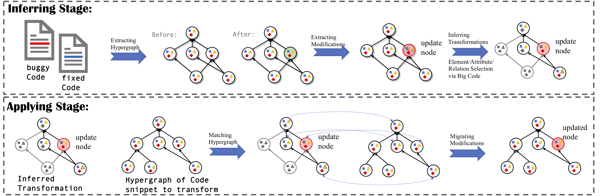

# GenPat

* [I. Introduction of GenPat](#user-content-i-introduction)
* [II. Environment setup](#user-content-ii-environment)
* [III. Run GenPat Step-by-Step](#user-content-iii-how-to-run)
* [IV. Evaluation Result](#user-content-iv-evaluation-result)
* [V. Structure of the project](#user-content-v-structure-of-the-project)

## I. Introduction

*GenPat* is an automatic program transformation inferring framework, which infers general (reusable) transformations from singular examples. In this process, it leverages a big code corpus to guide the inference process. The following figure is the workflow of our approach.



#### Inferring Stage

1. **Extracting Hypergraphs** : parses source code before and after changing into hypergraph representations with a set of attributes and relations in the graph.
2. **Extracting Modifications** : performs hypergraph differencing and extracts modifications related to corresponding nodes in the graph. Specifically, tree-based differencing, e.g., GumTree, can be used to perfrom the differencing as this hypergraph is a super graph with the original AST as backbone.
2. **Inferring Transformations** : based on the previous process, we know which nodes are modified. This step first selects a set of node according to the expansion starting from the changed nodes, which will constitute the context of the transformation. Next, a big code corpus will be utilized to select the attributes of those context nodes, i.e., frequently appeared attributes across projects will be kept in the transformation pattern, while others discarded.

As a result, the final transformation pattern contains a subset of the nodes in the hypergraph and their selected attributes.

#### Applying Stage

1. **Matching Hypergraph** : when given a transformation pattern and an examplar code snippet, *GenPat* first extracts a hypergraph from the code and tries to match it with the given pattern, where all nodes and attributes in the pattern should be matched with some one in the hypergraph of the examplar code.
2. **Migrating Modifications** : after matching the hypergraph with the pattern, a sequnence of mappings can be obtained to record the matching result of the hypergraphs. According to the mappings, modifications related to corresponding nodes can be transferred to the target hypergraph with replacing mapped variables and expressions.

*If you want to use this project, please cite our technical paper published on ASE'19.*

```tex
@inproceedings{GenPat:2019,
    author   = {Jiang, Jiajun and Ren, Luyao and Xiong, Yingfei and Zhang, Lingming},
    title    = {Inferring Program Transformations From Singular Examples via Big Code},
    series   = {ASE},
    year     = {2019},
    location = {San Diego, California, U.S.},
} 
```

## II. Environment

* OS: Linux (Tested on Ubuntu 16.04.2 LTS)
* JDK: Oracle jdk1.8 (**important!**)
* Mavan: Apache Maven 3.6
* Download and configure Defects4J.
* More runtime configurations can be found in the [config-file](/resources/conf).


## III. How to run

*GenPat* was traditionally developed as a Maven project via IntelliJ, you can simply import this project to your workspace and run it as a common Maven program or contribute it. The main class is **mfix.Main**, and for the running option please refer to the [Running Options](#user-content-running-options).

* As it is a maven project, a simpler method to build it is using the command line with `mvn package`, which will generate a runnable `jar` file in the `artifact` directory. (NOTE: Please ensure you have configured __Java & Maven__ environment first)

#### Running Options 

Our prototype of *GenPat* has multiple user interfaces for different purposes, basically you can run it within command line as:

```powershell
java -jar GenPat.jar FUNC ARGS
```

where the `FUNC` denotes the function/interface you want to use and `ARGS` is a set of arguments corresponding to the `FUNC`.

The following details some of the `FUNC` that are important:

```powershell
print: print the details of pattern
filter: filter and serialize patterns with given criteria.
repair: run porgram repair
cluster: run pattern cluster
```

More Details related to each `FUNC`: TBD.

#### Result Analysis

TBD.

## IV. Evaluation Result

TBD.

## V. Structure of the project
```powershell
  |--- README.md      :  user guidance
  |--- resources      :  resource files and configurations
  |--- doc            :  document
  |--- final          :  evaluation result
  |--- lib            :  dependent libraries
  |--- repair-result: :  evaluation result in our paper for program repair
  |--- replication    :  replication package with sampled cases
  |--- sbfl           :  fault localization tool
  |--- src            :  source code and test suite
```

----


<u>__ALL__ suggestions and contributions are welcomed.</u>
